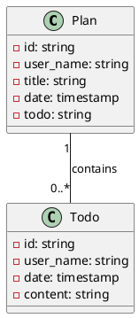

# CLAUDE.md

This file provides guidance to Claude Code (claude.ai/code) when working with code in this repository.

## Tech Stack

| Concern          | Choice                                                                                                                                                                                                                                                        |
|------------------|---------------------------------------------------------------------------------------------------------------------------------------------------------------------------------------------------------------------------------------------------------------|
| Language         | Go 1.25.1                                                                                                                                                                                                                                                     |
| Web framework    | Gin (`github.com/gin-gonic/gin v1.11.0`)                                                                                                                                                                                                                      |
| Persistence      | Postgres                                                                                                                                                                                                                                                      |
| ID generation    | google/uuid                                                                                                                                                                                                                                                   |
| Auth             | JWT validation via the shared `core-services/golang-web-framework` middleware; JWKS fetched from `http://local.api.vauthenticator.com:9090/oauth2/jwks`                                                                                                       |
| Shared framework | `github.com/mrflick72/onlyone-portal/core-services/golang-web-framework` — resolved via local `replace` directive in `go.mod` pointing to `../../core-services/golang-web-framework`                                                                          |
| Test assertions  | testify + go-playground/assert                                                                                                                                                                                                                                |
| Build tag        | `-tags test` is required for any test that imports shared fixtures. Helpers like `adapter/todo/db/test_utils.go` are guarded by `//go:build test` so they are never linked into the production binary. Running `go test ./...` without the tag will fail to compile. |

Config is read by the shared framework's `config.GetConfigurationManagerInstance()` (backed by Viper). The config file
path is set via the `CONFIG_FILE_LOCATION` env var.

## Commands

```bash
go build -o app .
go test ./web/...                           # unit tests only — no database needed, no build tag
go test -tags test ./adapter/...            # integration tests — require Postgres
go test -tags test ./...                    # all tests
go test -tags test -run TestGetTodo ./adapter/todo/db/...  # single integration test
```

## Architecture

plan-service is a Go service using the **shared Gin framework** (`core-services/golang-web-framework`), consistent with
the other portal services. JWT validation is handled by the shared middleware.

**Request path:** `main.go` → `web/todo/` (Gin handlers) → `adapter/todo/db/` (Postgres repository) → `domain/todo/`
(pure domain types).

**Packages:**
Hexagonal layout — keep changes inside the right layer:

```
domain/
  plan/   # Plan, PlanDetails, PlanRepository
  todo/   # Todo, TodoRepository
adapter/
  plan/db/  # Postgres impl of PlanRepository (stub — not yet implemented)
  todo/db/  # Postgres impl of TodoRepository; buildTodos row mapper
web/
  todo/   # package api — RegisterEndpoints, TodoEndpoints handlers, todoRepresentation, to/from domain converters
config/   # composition root — NewPostgresDSN
pkg/
  clock/    # date parsing/formatting (YYYY-MM-DD ↔ time.Time)
  database/ # sql.Open + CloseResources helpers
main.go     # WebServerProvisioner + registers todo endpoints
```

**Shared framework behaviour (inherited):**

- `server.WebServerProvisioner` auto-configures CORS, JWT middleware, and `GET /management/health`
- JWT middleware skips `/management/*` and `OPTIONS`; authenticated user available via `security.GetCurrentUser(ctx)`
  after `server.GinContextToPlainContextFactory`
- Config values accessed via `config.GetConfigurationManagerInstance().GetConfigFor("key")`

**Notable unfinished work:** `PlanRepository` in `adapter/plan/db/repository.go` is a stub — all methods return nil.

## Domain Model

The core domain entities and their relationships:



At the database level, one Plan may have zero or more Todos. The relationship is enforced via foreign key constraint on the `planId` column in the `todo` table.

## Configuration

Set `CONFIG_FILE_LOCATION` to a YAML config file path. Required keys:

```yaml
server:
  port: 5050

cors:
  allowed:
    origins: http://local.onlyone-portal.com:8070

idp:
  jwks-endpoint: http://local.api.vauthenticator.com:9090/oauth2/jwks

user:
  required-role: PLAN_READER

database:
  url: localhost
  name: postgres
  user: postgres
  password: postgres

logger:
  level: info
  file-name: log.log
```

A ready-to-use local config is at `test/application.yml`.

## Testing

**Unit tests** (`web/todo/`) use an in-memory mock repository — no database, no build tag:

```bash
go test ./web/...
```

**Integration tests** (`adapter/todo/db/`) hit a real Postgres instance and require `-tags test`:

```bash
cd test && docker compose up -d
CONFIG_FILE_LOCATION=test/application.yml go test -tags test ./adapter/...
```

Apply the schema from `scripts/init.sql` before running integration tests for the first time. Each test truncates the
`todo` table via `clearDatabase()` in `adapter/todo/db/test_utils.go`.
